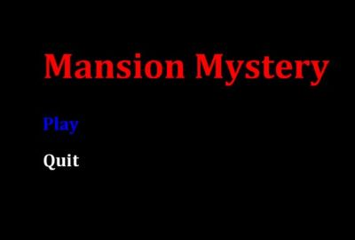
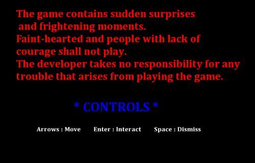
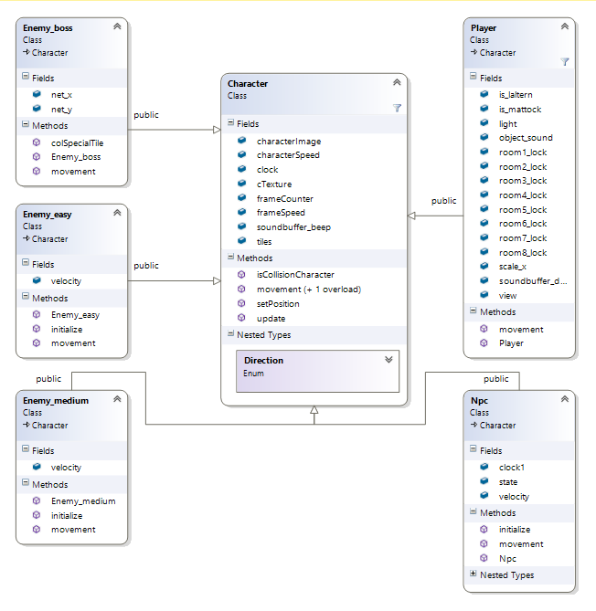
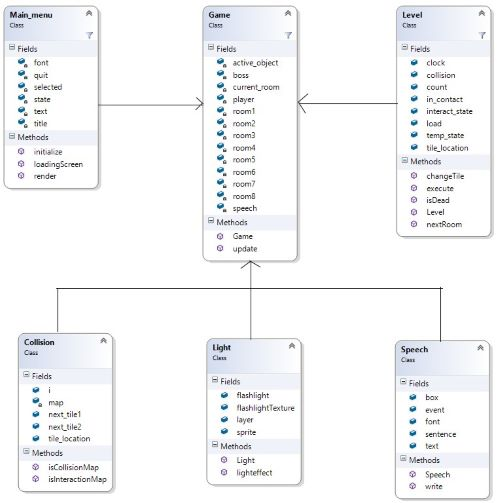
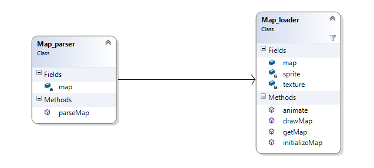
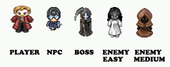
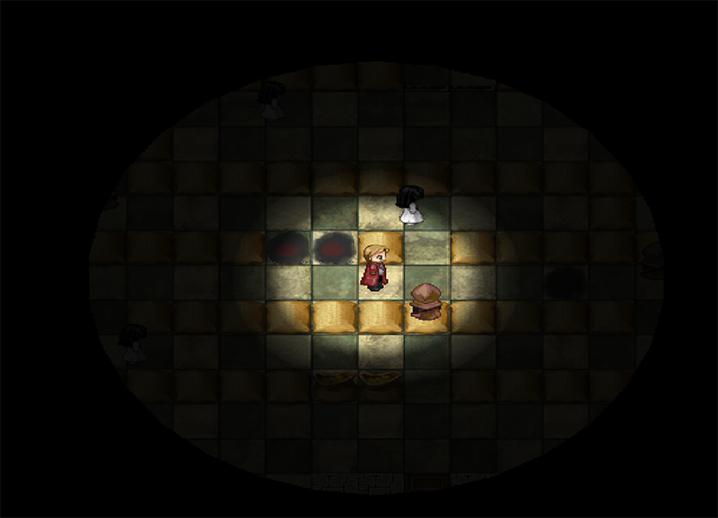

# 2D RPG horror game

## Objective
### Design a 2D RPG horror game in C++ utilizing OpenGL and SFML multimedia library. Incorporate map design, shadow physics, collision handling and program Artificial Intelligence bots.

## Download
This is my first attempt to make games, And I really enjoyed it

Direct download - https://onedrive.live.com/redir?resid=42BA9F14034F3876!756&authkey=!AMURWA8X5otI-Ik&ithint=file%2crar


## Introduction
Mansion Mystery is a 2D Role playing horror game where the story revolves around a paranormal investigator who has been called to investigate and solve the mystery of an old mansion. The main character must face several obstacles in form of mini bosses, impassable terrains and traps finding his way to fight the devil to eliminate the evil from the mansion. The main boss aka The Devil is a programmed AI bot whose objective is to kill the player. The final objective of player is to find the devil's corpse and stab it with a special dagger.

My interest in video game programming and Artificial Intelligence motivated my choice for this summer project. This game gave me an opportunity to learn more about OOPs, Artificial Intelligence and ways to implement different heuristics. Keeping the resource usage minimum and code reusability was a challenge for me. The player will progress through levels which require precise manipulation of the environment, though the game Encourages creativity, patience and courage by offering branching pathways.


## How to Run
Note: The game is supported only on Windows Platform
Go to project directory -> Release

(Install vcredist_x86 from Redist folder If you don't have visual c++ Redistributable 2012)

Run the game using Mansion Mystery.exe

## How to Play



The user is presented with Onscreen instructions on how to play the game. Followed by the Game Menu



Using the arrows the player can navigate across the map and use Return key to interact with objects.The game is pretty much self-explanatory and specific instructions are brought up when required. The story unfolds as the game progresses and player has to obtain the 'key' in each level which is required to unlock the next door.

At the second last level the player is given a choice to pick an easy ending or a more challenging one.

## Tools Used
**C++**

C++ is a high level programming language, developed in 1983 by Bjarnes Stroustrup, in Bell Laboratories. It is an object oriented version of ‘C’ language. C++ is one of the most used programming languages in the world and they were designed for close to the metal low level programming

**Simple Fast Multimedia Library**

SFML handles window creation and input as well as the creation and management of OpenGL contexts. It also provides a graphics module for simple hardware-accelerated 2D graphics which includes text rendering utilizing FreeType, an audio module that utilizes OpenAL and a networking module for basic TCP and UDP communication. It is composed of five modules:
- System - Vector and Unicode string classes, portable threading and timer facilities
- Window - Window and input device management including support for joysticks, OpenGL context management
- Graphics - Hardware-accelerated 2D graphics including sprites, polygons and text rendering
- Audio - Hardware-accelerated spatialised audio playback and recording
- Network - TCP and UDP sockets, data encapsulation facilities, HTTP and FTP classes

official site:  http://www.sfml-dev.org/

**Microsoft Visual Studio**

Microsoft Visual Studio is an integrated development environment (IDE) from Microsoft. It is used to develop computer programs for Microsoft Windows, as well as web sites, web applications and web services. Visual Studio uses Microsoft software development platforms such as Windows API, Windows Forms, Windows Presentation Foundation, Windows Store and Microsoft Silverlight. It can produce both native code and managed code.

## Architecture and Design
The game consists of 14 Classes and 40 functions designed in such a way so as to minimize coupling and increase cohesion.
Class Diagram



The Character class is the superclass which contains methods specific to overall movement, position, inter collision of player and Enemy AI. The subclass player holds various essential attributes that govern the player progress in the game.




A level map consist of a 32 x 24 grid. This makes 768 tiles each level where texture is to be drawn. To be able to get information while the game is running, all those intersections have an associated number. This number is called “bitmask” and allows us to set information directly on the grid. This information is stored in a text file which is parsed by Map_parser in a matrix.
The Map_loader draws the texture corresponding to each matrix element.



## Implementation
### Characters


Designing an application to render textures and sprites on screen that allows a user to move the sprite across a tile based map unique to each level. In order for this project to be truly successful, the speed of execution must be reasonable. This brings an additional challenge to this project. Indeed, the algorithm that we will use must be accurate as well as optimized to render the game at good frame rates and also consuming minimum of computer memory and processor.

The game should be able to be paused and resumed/restarted without losing any progress.
When the Boss comes in the vicinity of Player a trigger starts pulsating sound. While avoiding the boss the player needs to complete the objective of taking out the corpse by using tools provided in the level. Taking out the corpse and stabbing it completes the game.


### Lights and Shadows
I have put a mechanism to restrict the vision of player across the map by adjusting the lights to give a night time atmosphere to the game. The light decreases exponentially with respect to distance from the main character.



### Artificial Intelligence

The AI has to be programmed in such a way that it finds the lowest cost route(optimum path) to reach the player using the graph i.e. a tile based map

I reseached about many different algorithms and implemented some to understand them better. The prominent ones are-
Greedy Best First algorithm
Using a greedy algorithm, expand the first successor of the parent. After a successor is generated
1.	If the successor's heuristic is better than its parent, the successor is set at the front of the queue (with the parent reinserted directly behind it), and the loop restarts.
2.	Else, the successor is inserted into the queue (in a location determined by its heuristic value). The procedure will evaluate the remaining successors (if any) of the parent.

Heuristic used is the euclidean distance between source and destination in x and y direction

Similarly, I improved the algorithm with A* Algorithm which uses the cost function similar to Djkstra's algorithm with and added heuristic like best first search to cost.


## Testing

```
Test Case 1

Test Case	:	This test will check if the animation is working correctly.
Test Procedure	:	Run the game and control the character by using arrow keys .
Expected Result	:	Animation works perfectly in the environment.
Actual Result	:	Animation is not working.
Comment	  :	      Need to check character configuration on inspector window. The appropriate animation was not selected. Select it.
Conditional Test	:	Again run scene.
Expected Result	:	Animation is working now.
Actual Result	:	Yes, it is working.
Accuracy	:	Accuracy depends on hardware configuration.

Test Case 2

Test Case	:	This test will check if the interaction between objects is working correctly.
Test Procedure	:	Add scripts of interaction in the objects that we want to interact with each other. Run scene.
Expected Result	:	Objects are interacting.
Actual Result	:	Run time exception
Comment	  :	    Need to add checking in the scripts for the objects that have a particular script.
Conditional Test	:	Run scene.
Expected Result	:	Interaction is ok now.
Actual Result	:	Interaction is ok now.
Accuracy	:	Perfectly accurate.

```

## Conclusion
The goal of the project was to realize a RPG game that could be played by autonomous players. The AI also has to be reasonably smart and I managed to realize this consistently with the theoretical approach.

Mansion Mystery has been a very interesting project for me since it allowed me to get a glimpse of the complexities involved in designing the game and vast world of artificial intelligence.

